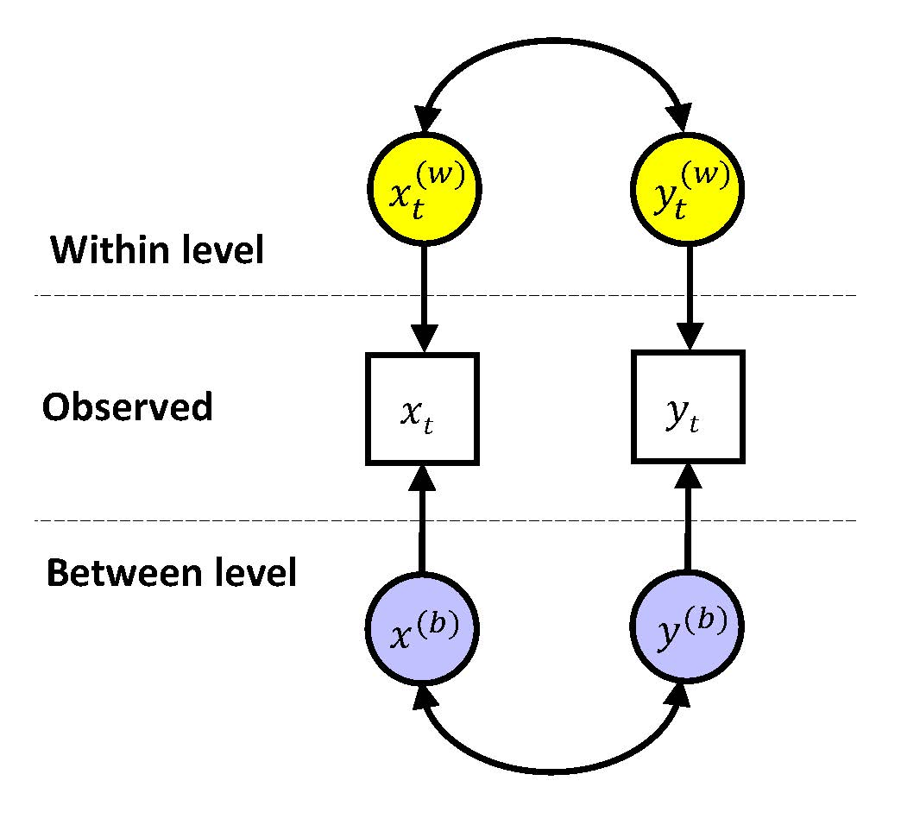
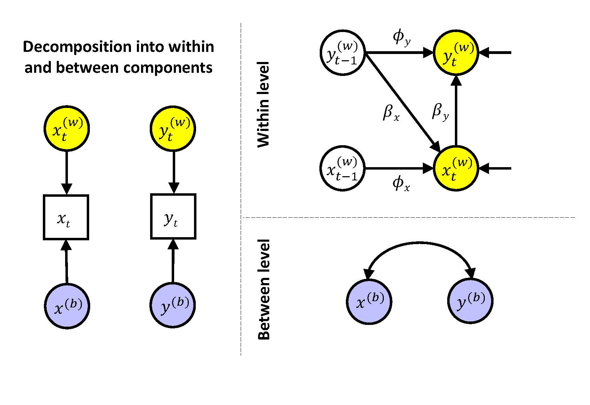
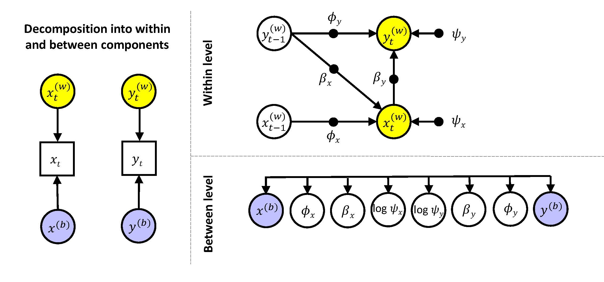
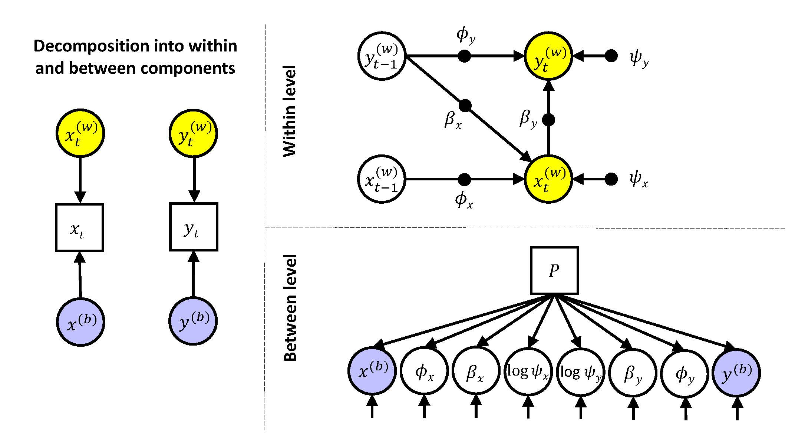
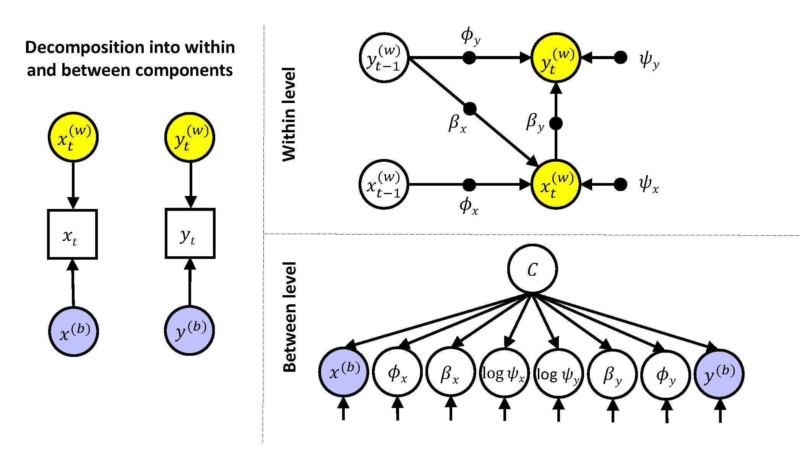
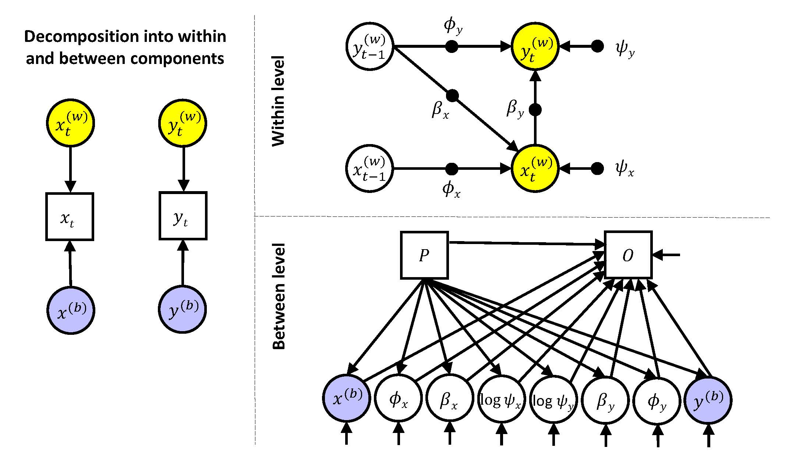
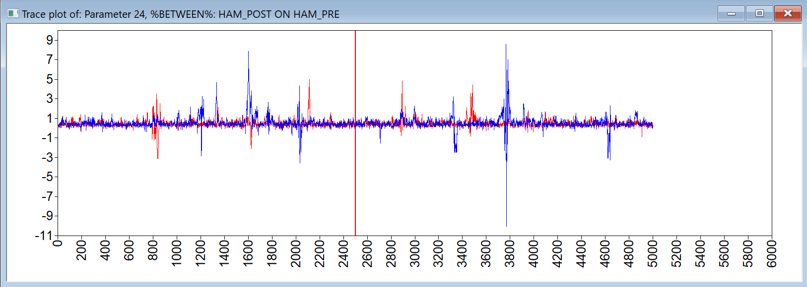
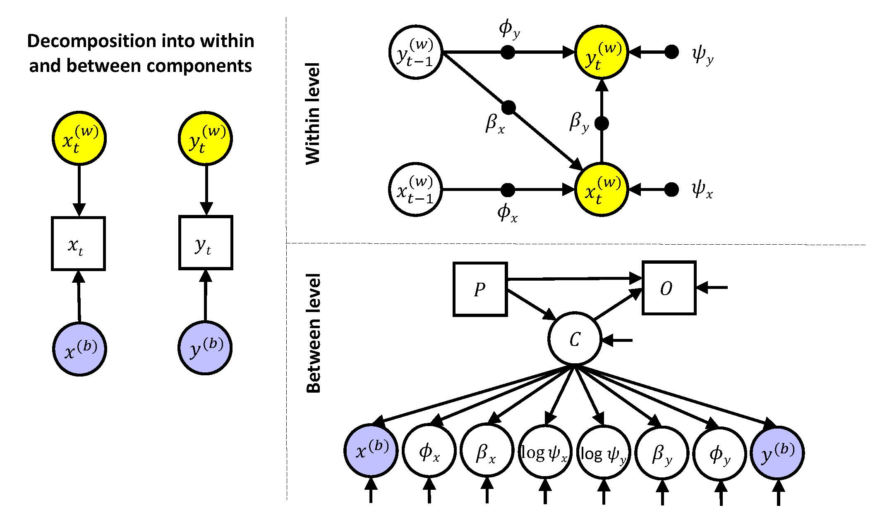

Instead of analyzing the data for each person separately using replicated time series analysis, we can analyse the data of the 129 individuals in a single multilevel model. 

In the book chapter we consider 6 dynamic multilevel models: 

* __Multilevel models 1-3__ are based on combining time series modeling with multilevel modeling

* __Multilevel models 4-6__ are based on combining times series modeling and multilevel modeling with structural equation modeling 

As an initial step, we determine the intraclass correlation of each variable in __Multilevel Model 0__.

Below, we start by discussing some general aspects of the multilevel analyses; then we present each model, discuss how it is specified, and discuss the output.  

# General comments

This approach should be based on decomposing the observed variables into a within-person part and a between-person part, that is

$x_{it} = x_{it}^{(w)} + x_{i}^{(b)}$

$y_{it} = y_{it}^{(w)} + y_{i}^{(b)}$

For both components a model is then specified: At the within level a time series model is specified to account for the dynamics in the repeated measures within a person, and at the between level the random effects can be related to each other. 

In Mplus, this approach requires the repeated measures within a person to be represented in long format (as before), while the data of all the individuals are stacked. There has to be a specific variable that indicates to which individual the data belong. 

The `DATA` command now becomes:

      DATA: file is ChapterData1.dat;

The `VARIABLE` command is given as:

      NAMES       =   ID prepost TimeHours U2P PA NA PEx NEx
                      pa_pre na_pre U2P_pre PEx_pre NEx_pre
                      pa_post na_post U2P_post PEx_post NEx_post
                      ham_pre ham_post group;
      CLUSTER     =   ID;
      USEVAR      =   na_pre ue_pre;
      MISSING     =   ALL(-999);

where the statement `CLUSTER = ID` is used to specify the variable that contains information about the clustering of the data. 

Again, we are using the variable ue_pre in our analyses, which is not part of the observed data file, but created using:

    DEFINE:     ue_pre = -1*U2P_pre;

Note that we are no longer using the `DEFINE` command to standardized the variables; if we would use that approach, it would use the total observed variance (i.e., across all time points _and_ participants). As we will see below---and as described in the book chapter---when we standardize parameters, we want this to be based on the variance at the level where the parameter is situated; moreover, we want the individual slopes to be standardized with the individual specific variances, rather than some average across individuals, or a variance that contains both within and between person variance. 

As all the models we run here are multilevel models and we want to use Bayesian estimation, our `ANALYSIS` command will contain:

The command `ANALYSIS` is specified as:

      ANALYSIS:   TYPE = TWOLEVEL;
                  ESTIMATOR = BAYES;
                  PROC = 2;
                  BITER = (3000);
                  BSEED = 6974;
                  THIN = 5;

where the statement `TYPE = TWOLEVEL` ensures that the data are decomposed into a within-person component that varies over time, and a between-person component that does not vary over time. The other statements are all related to Bayesian estimation, and were discussed under the $N=1$ analyses.

To obtain the plots that are used to evaluate the Bayesian estimation, we include the `PLOT` command:

     PLOT: TYPE = PLOT3;

This will allow us to look at trace plots for each parameter (i.e., the MCMC samples of the two chains that are run), posterior distributions of each parameter, the autocorrelation function for each parameter over the MCMC iterations.

If also include:

          FACTOR = ALL (500);

in the`PLOT` command, Mplus will save 500 samples from the individually sampled parameters per person, and we can plot the means or medians of these per person. It will also allow us to ask for a comparison of the factor scores (i.e., the individual's parameter estimates), as we will show below.

$~$

# Multilevel Model 0

The intraclass correlation indicates the proportion of variance that is due to stable between-person differences. It is computed as: 

$$ icc_y = \frac{var(y^{(b)})}{var(y^{(b)})+var(y^{(w)}}) $$

To estimate these quantities for each variable, we specify a bivariate, empty multilevel model, in which each variable is decomposed into a time-varying within-person component, and a time-invariant between-person component. This can be visualized as

{width=40%}

This model allows us to estimate the variances at the within level and at the between level, and from these we can compute the intraclass correlations.

## Input MLM0
We make use of the `ANALYSIS` command such as presented above, indicating `TYPE = TWOLEVEL` and `ANALISYS = TWOLEVEL`. 
Subsequently, we need to define a model at the within level and at the between level. We use the `MODEL` command:

      MODEL:
      %WITHIN%
      na_pre WITH ue_pre;
      na_pre (wvar_na);
      ue_pre (wvar_ue);

      %BETWEEN%
      na_pre WITH ue_pre;
      na_pre (bvar_na);
      ue_pre (bvar_ue);
      
As we have given the variances of each variable at each level a name, we can refer to them in the `MODEL CONTRAINT` command where we create two new parameters, icc_na and icc_ue:

      MODEL CONSTRAINT:
      NEW (icc_na); icc_na = bvar_na/(bvar_na + wvar_na);
      NEW (icc_ue); icc_ue = bvar_ue/(bvar_ue + wvar_ue);

As each of these new parameters is computed within each iteration in the MCMC algorithm, we will also obtain a posterior distribution for them.

## Output MLM0

This model provides the following parameter estimates:

    MODEL RESULTS

                                    Posterior  One-Tailed         95% C.I.
                        Estimate       S.D.      P-Value   Lower 2.5%  Upper 2.5%  Significance

    Within Level

     NA_PRE   WITH
        UE_PRE             0.415       0.019      0.000       0.378       0.452      *

     Variances
        NA_PRE             0.682       0.012      0.000       0.659       0.707      *
        UE_PRE             2.842       0.052      0.000       2.742       2.945      *

    Between Level

     NA_PRE   WITH
        UE_PRE             0.171       0.045      0.000       0.090       0.266      *

     Means
        NA_PRE             2.068       0.067      0.000       1.936       2.200      *
        UE_PRE            -1.246       0.052      0.000      -1.346      -1.144      *

     Variances
        NA_PRE             0.569       0.077      0.000       0.443       0.742      *
        UE_PRE             0.287       0.047      0.000       0.213       0.392      *

    New/Additional Parameters
        ICC_NA             0.455       0.033      0.000       0.392       0.523      *
        ICC_UE             0.092       0.014      0.000       0.070       0.121      *

The part of the output that is of interest to us, are the last two lines where the intraclass correlations are computed for each variable. Note that by definition, the 95% CIs that are computed will not cover zero; hence, when zero is not included in the CI, this should not be interpreted as evidence that the intraclass correlation is different from zero. Instead, we may want to consider the lower bound and determine whether this is relatively close to zero or not, based also on the mean of the posterior distribution (i.e., the point estimate that is reported).

Here we see that the difference in the proportion between-person variance is quite large for these two variables: About 0.46 for negative affect, and only 0.09 for unpleasantness of events. The latter implies that the reported unpleasantness of events contains mostly within-person variation over time, whereas negative affect contains much more substantial differences between persons. 

$~$

# Multilevel Model 1

Our first model is based on decomposing the data into a within-person and a between-person component, and specifying a time series model at the within level with fixed (i.e., non varying) slopes and residual variances. At the between level, we thus have only the two random effects from the decomposition, that is, the persons' means on negative affect and unpleasantness of events. This model can be represented as

{width=60%}

At the within level we can write: 

$x_{it}^{(w)} = \phi_x x_{it-1}^{(w)} + \beta_x y_{it-1}^{(w)} + \zeta_{xit}$ 

$y_{it}^{(w)} = \phi_y y_{it-1}^{(w)} + \beta_y x_{it}^{(w)} + \zeta_{yit}$

and at the between level we can write

$x_{i}^{(b)} = \gamma_{x0} + u_{x0i}$   

$y_{i}^{(b)} = \gamma_{y0} + u_{y0i}$

## Input MLM1

To specify this model, we need to specify the model at the within level and at the between level. Since both variables that we use (na_pre and ue_pre) are time-varying, they will exist at both levels. At the within level we specify the same time series model that we ended our $N=1$ analyses with. The four regressions and the residual variances will be non-random, which means every person gets the same values for these. At the between level we therefor only have the two individual means of the two variables; we allow these to be correlated. 

To allow for the lagged regressions, and ensure that the varying length of the time intervals is taken into account, we now add to the `VARIABLE` command the `LAGGED` and `TINTERVAL` option again, that is

      LAGGED      =   na_pre(1) ue_pre(1);
      TINTERVAL   =   TimeHours(1);

The model is now specified as: 

    MODEL:
      %WITHIN%
      na_pre ON na_pre&1; ! autoregression NA (lag 1)
      na_pre ON ue_pre;   ! cross-regression from UE to NA (lag 0)
      ue_pre ON ue_pre&1; ! autoregression UE (lag 1)
      ue_pre on na_pre&1; ! cross-lagged regression from NA to UE (lag 1)

      %BETWEEN%
      ! allow all random effects to be correlated
      na_pre WITH ue_pre;
      

## Output MLM1

The parameter estimates for this model are organized by level, with the within level parameters presented first, and the between level parameters afterwards. 

    MODEL RESULTS

                                    Posterior  One-Tailed         95% C.I.
                       Estimate       S.D.      P-Value   Lower 2.5%  Upper 2.5%  Significance

    Within Level

    NA_PRE     ON
        NA_PRE&1           0.534       0.011      0.000       0.512       0.557      *
        UE_PRE             0.110       0.006      0.000       0.099       0.121      *

    UE_PRE     ON
        UE_PRE&1           0.154       0.020      0.000       0.116       0.194      *
        NA_PRE&1           0.218       0.033      0.000       0.154       0.283      *

    Residual Variances
        NA_PRE             0.445       0.009      0.000       0.429       0.464      *
        UE_PRE             2.735       0.051      0.000       2.637       2.839      *

    Between Level

    NA_PRE   WITH
        UE_PRE             0.157       0.045      0.000       0.079       0.259      *

    Means
        NA_PRE             2.061       0.068      0.000       1.921       2.196      *
        UE_PRE            -1.255       0.052      0.000      -1.357      -1.153      *

    Variances
        NA_PRE             0.560       0.078      0.000       0.431       0.734      *
        UE_PRE             0.270       0.045      0.000       0.198       0.374      *

Hence, we see that for all four average slopes (i.e., `ON` statements) there is evidence that they deviate from zero. However, these are all unstandardized parameters. 

Filling in the parameter estimates, the within level becomes: 

$$UE_{it}^{(w)} = 0.15*UE_{it-1}^{(w)} + 0.22*NA_{it-1}^{(w)} + \zeta_{UEit} \;\;\;\;\;\;\; var(\zeta_{UEit})=2.74$$ 

$$NA_{it}^{(w)} = 0.53*NA_{it-1}^{(w)} + 0.11*UE_{it}^{(w)} + \zeta_{NAit} \;\;\;\;\;\;\; var(\zeta_{NAit}) = 0.46$$

and at the between level we can write

\begin{align}
&UE_{i}^{(b)} = 2.06 + u_{UE0i} \;\;\;\;\;\;\;\;\;\;\;\; var(u_{UE0i}) = 0.27\\
&NA_{i}^{(b)} = -1.26 + u_{NA0i}\;\;\;\;\;\;\;\;\;\;\;\; var(u_{NA0i}) = 0.56 \;\;\;\;\;\;\;\;\;\;\;\; cov(u_{NA0i}, u_{UE0i}) = 0.16
\end{align}

While autoregressive parameters are hardly affected by standardization (as the predictor and the outcome have the same variance), the cross-regressions are likely to change as a result of standardization. We may prefer the standardized results as they allow for an interpretation in terms of effect sizes. Alternatively, we may prefer the original, unstandardized results, as they allow for an interpretation close to the original scales that were used in measuring the variables.

The standardized results are obtained as part of the additional `OUTPUT`:

    STANDARDIZED MODEL RESULTS

    STDYX Standardization

                                    Posterior  One-Tailed         95% C.I.
                        Estimate       S.D.      P-Value   Lower 2.5%  Upper 2.5%  Significance
    Within Level

     NA_PRE     ON
        NA_PRE&1           0.534       0.011      0.000       0.512       0.557      *
        UE_PRE             0.221       0.011      0.000       0.199       0.243      *

     UE_PRE     ON
        UE_PRE&1           0.154       0.020      0.000       0.116       0.194      *
        NA_PRE&1           0.108       0.017      0.000       0.077       0.141      *

     Residual Variances
        NA_PRE             0.629       0.013      0.000       0.603       0.654      *
        UE_PRE             0.954       0.008      0.000       0.937       0.968      *

    Between Level

     NA_PRE   WITH
        UE_PRE             0.405       0.089      0.000       0.222       0.567      *

     Means
        NA_PRE             2.754       0.208      0.000       2.360       3.175      *
        UE_PRE            -2.414       0.216      0.000      -2.859      -2.006      *

     Variances
        NA_PRE             1.000       0.000      0.000       1.000       1.000
        UE_PRE             1.000       0.000      0.000       1.000       1.000

    R-SQUARE

    Within Level

                                    Posterior  One-Tailed         95% C.I.
        Variable        Estimate       S.D.      P-Value   Lower 2.5%  Upper 2.5%

        NA_PRE             0.371       0.013      0.000       0.346       0.397
        UE_PRE             0.046       0.008      0.000       0.032       0.063

The regression parameters (i.e., the `ON` statements) are standardized with the model implies variances at the within level. The residual variances at the within level represent the average proportion of unexplained variance; the corresponding proportions of explained variance can be found at the bottom as the `R-SQUARE`. 

The `WITH` statement at the between level can be interpreted as the correlation between the (model implied) means of individuals on negative affect and unpleasantness of events. This correlation of 0.405 indicates that individuals with a higher trait level for negative affect also tend to report more unpleasantness of events on average over time. 

The `MEANS` in the standardized solution indicate the number of standard deviations that the grand mean differs from zero. In general this is less informative and can be ignored. Furthermore, since there are not predictors of the random means at the between level, the standardized variances of the two variables are simply 1. 

Compared to the highly idiographic approach that we used before (the replicated $N=1$ analyses), the current model is extremely restrictive: While we allow for individual differences in means, everything else is constrained across individuals, meaning that we assume each individual is characterized by the exact same dynamics and sensitivity to external influences. This is not very realistic; therefore, in all the following model we relax these constraints and allow for random slopes and random residual variances. 

$~$

# Multilevel Model 2
In the second model (and all subsequent models) we allow for random slopes and random residual variances. This adds six more random effects to the model. The eight random effects are allowed to covary with each other at the between level. This model can be represented as

{width=90%}

Note that filled circles at the within level indicate these parameters are random, meaning every individual has their own values for them. These individual parameters are modeled as latent variables at the between level (where there are open circles that correspond to the filled circles from the within level). The arrow system connecting the eight random effects implies they are all allowed to be correlated. These random effects are assumed to come from a multivariate normal distribution. Note that the residual variances from the within level are log transformed at the between level; this implies that when there is a negative value for this quantity at the between level, this is associated with a within-person residual variance between 0 and 1.  

The model above can be expressed at the within level as:

\begin{align*}
&y_{it}^{(w)} = \phi_{yi} y_{it-1}^{(w)} + \beta_{yi} x_{it}^{(w)} + \zeta_{yit}\\
&x_{it}^{(w)} = \phi_{xi} x_{it-1}^{(w)} + \beta_{xi} y_{it-1}^{(w)} + \zeta_{xit}
\end{align*}

and at the between level as:

\begin{align*}
y_{i}^{(b)} &= \gamma_{y0} + u_{y0i}\\
x_{i}^{(b)} &= \gamma_{x0} + u_{x0i}\\
\phi_{yi} &= \gamma_{y1} + u_{y1i}\\
\phi_{xi} &= \gamma_{x1} + u_{x1i}\\
\beta_{yi} &= \gamma_{y2} + u_{y2i}\\
\beta_{xi} &= \gamma_{x2} + u_{x2i}\\
log(\psi_{yi}) &= \gamma_{y3} + u_{y3i}\\
log(\psi_{xi}) &= \gamma_{x3} + u_{x3i}
\end{align*}

where the $\gamma$'s are the fixed (or averaged) effects, and the $u$'s are the individual deviations from these means. These random components are allowed to be correlated. Specifically, we have
\begin{align*}
\begin{bmatrix}
u_{y0i}\\
u_{x0i}\\
u_{y1i}\\
u_{x1i}\\
u_{y2i}\\
u_{x2i}\\
u_{y3i}\\
u_{x3i}
\end{bmatrix}
\sim
MN \begin{pmatrix} \begin{bmatrix}
0\\0\\0\\0\\0\\0\\0\\0
\end{bmatrix}, 
\begin{bmatrix}
\tau^2_{y0}\\
\tau_{x0y0} & \tau^2_{x0}\\
\tau_{y1y0} & \tau_{y1x0} & \tau^2_{y1}\\
\tau_{x1y0} & \tau_{x1x0} & \tau_{x1y1} & \tau^2_{x1}\\
\tau_{y2y0} & \tau_{y2x0} & \tau_{y2y1} & \tau_{y2x1} & \tau^2_{y2}\\
\tau_{x2y0} & \tau_{x2x0} & \tau_{x2y1} & \tau_{x2x1} & \tau_{x2y2} & \tau^2_{x2}\\
\tau_{y3y0} & \tau_{y3x0} & \tau_{y3y1} & \tau_{y3x1} & \tau_{y3y2} & \tau_{y3x2} & \tau^2_{y3}\\
\tau_{x3y0} & \tau_{x3x0} & \tau_{x3y1} & \tau_{x3x1} & \tau_{x3y2} & \tau_{x3x2} & \tau_{x3y3} & \tau^2_{x3}
\end{bmatrix}\end{pmatrix}
\end{align*}
that is, the random effects are assumed to come from a multivariate normal distribution, where the diagonal elements of the covariance matrix ($\tau^2_{y0}$ to $\tau^2_{x3}$) represent their variances, and the off-diagonal elements represent the covariances. 

## Input MLM2
To allow for random slopes and residual variances, we have to change the `TYPE` option in the `ANALYSIS` command to

    ANALYSIS:   TYPE = TWOLEVEL RANDOM;

where `TWOLEVEL` ensures we will decompose the time-varying variables in a within-person component that varies over time, and a between-person component that is invariant over time, and `RANDOM` allows for the additional random effects. 

These random slopes and residual variances are specified in the `%WITHIN%` model, using a vertical bar `|`; left of this, the name of the random effect is given, and right of it, an expression is given of the parameter that needs to be included as random. The names that are given at the within level, can then be used to model relations between the random effects at the between level. The current model is specified as:

      MODEL:
      %WITHIN%
      phi_na | na_pre ON na_pre&1; ! autoregression NA (lag 1)
      b_ae | na_pre ON ue_pre;     ! cross-regression from UE to NA (lag 0)
      phi_ue | ue_pre ON ue_pre&1; ! autoregression UE (lag 1)
      b_ea | ue_pre on na_pre&1;   ! cross-lagged regression from NA to UE (lag 1)
      var_na | na_pre;             ! random residual variance NA
      var_ue | ue_pre;             ! random residual variance UE

      %BETWEEN%
      ! allow all random effects to be correlated
      na_pre ue_pre phi_na-var_ue WITH ue_pre phi_na-var_ue;

The first four lines of the within level model are used to specify the random slopes; the last two lines of the within level model are used to specify the random residual variances (mote that at the within level these are variances, while at the between level these are log transformed).

At the between level all eight random effects are allowed to be correlated. 

We will also ask for additional output, through

    OUTPUT: TECH1 TECH8 STDYX FSCOMPARISON STAND(CLUSTER);

    PLOT: TYPE = PLOT3;
          FACTOR = ALL (500);

where

`TECH1` provides information about where the free model parameters are (when representing the model using a LISRL format)

`TECH8` contains the information about the potential scale reduction parameter over every 100 iterations of the MCMC algorithm

`STDYX` provides the standardized results

`FSCOMPARISONS` provides comparisons between all 129 participants on their estimated scores for the random effects; this option requires the use of `FACTOR = ALL (500)` as part of the `PLOT` command, as this ensures that the MCMC runs an addition---in this case---500 iterations of the MCMC algorithm and saves the individually sampled parameters (i.e., the eight random effects in this model). 

`STAND(CLUSTER)` gives the standardized results per person

## Output MLM2
In contrast to the previous model, in which the autoregressions, cross-regressions, and residual variances were constrained to be invariant across individuals, the current model allows for individual differences. This implies that for each of the 129 persons, in every iteration of the MCMC algorithm, six individual parameters are sampled. This will often result in a warning given by Mplus that we obtained here:

        WARNING: PROBLEMS OCCURRED IN SEVERAL ITERATIONS IN THE COMPUTATION OF THE STANDARDIZED 
        ESTIMATES FOR SEVERAL CLUSTERS. THIS IS MOST LIKELY DUE TO AR COEFFICIENTS GREATER 
        THAN 1 OR PARAMETERS GIVING NON-STATIONARY MODELS. SUCH POSTERIOR DRAWS ARE REMOVED. 
        THE FOLLOWING CLUSTERS HAD SUCH PROBLEMS:
          120 66 39 134 116 144 28 117 3 141

This warning is related to the fact that if the autoregressive parameter in a first-order autoregressive model is 1 or larger than 1 (or -1 or smaller than -1), the process is not stationary, meaning: It does not vary around a constant with the same amount of variance over time. To check whether there is a problem with this analysis, we can: a) look at the sequences of the individuals; and b) check their individual posterior distributions (which we can plot since we used the `FACTOR = ALL(500)` statement). We may also decide to run the analyses without these individual, to see whether this has an effect on the overall results.

Since all the slopes and residual variances are random, there are no model parameters at the within level. Instead, all the parameter of this model are: 8 fixed (averaged) effects, 8 variances of these random effects, and 7*8/2=28 covariances between these 8 random effects. 

    MODEL RESULTS

                                   Posterior  One-Tailed         95% C.I.
                       Estimate       S.D.      P-Value   Lower 2.5%  Upper 2.5%  Significance

    Within Level

    Between Level

     NA_PRE   WITH
        PHI_NA             0.029       0.020      0.072      -0.012       0.068
        B_AE               0.030       0.008      0.000       0.017       0.047      *
        PHI_UE             0.007       0.024      0.374      -0.039       0.055
        B_EA              -0.062       0.038      0.036      -0.145       0.005
        VAR_NA             0.505       0.091      0.000       0.352       0.705      *
        VAR_UE            -0.001       0.045      0.491      -0.087       0.087

     UE_PRE   WITH
        PHI_NA             0.011       0.016      0.246      -0.020       0.044
        B_AE               0.007       0.005      0.069      -0.002       0.018
        PHI_UE             0.013       0.018      0.238      -0.024       0.047
        B_EA              -0.005       0.030      0.436      -0.069       0.051
        VAR_NA             0.179       0.065      0.002       0.063       0.318      *
        VAR_UE             0.104       0.037      0.001       0.036       0.182      *

     PHI_NA   WITH
        B_AE              -0.002       0.002      0.146      -0.007       0.002
        PHI_UE            -0.003       0.007      0.335      -0.018       0.011
        B_EA               0.006       0.013      0.303      -0.021       0.030
        VAR_NA             0.023       0.028      0.195      -0.030       0.080
        VAR_UE             0.001       0.015      0.472      -0.028       0.032

     B_AE     WITH
        PHI_UE             0.003       0.002      0.091      -0.002       0.008
        B_EA              -0.007       0.004      0.017      -0.016      -0.001      *
        VAR_NA             0.040       0.009      0.000       0.024       0.061      *
        VAR_UE            -0.006       0.005      0.136      -0.016       0.005

     PHI_UE   WITH
        B_EA              -0.008       0.013      0.244      -0.036       0.016
        VAR_NA             0.026       0.029      0.189      -0.031       0.082
        VAR_UE             0.012       0.015      0.202      -0.017       0.042

     B_EA     WITH
        VAR_NA            -0.147       0.062      0.003      -0.294      -0.043      *
        VAR_UE             0.025       0.022      0.106      -0.016       0.072

     VAR_NA   WITH
        VAR_UE             0.068       0.058      0.112      -0.043       0.187

     NA_PRE   WITH
        UE_PRE             0.178       0.050      0.000       0.090       0.287      *

     Means
        NA_PRE             2.035       0.068      0.000       1.903       2.172      *
        UE_PRE            -1.261       0.056      0.000      -1.369      -1.154      *
        PHI_NA             0.470       0.024      0.000       0.421       0.516      *
        B_AE               0.111       0.008      0.000       0.095       0.127      *
        PHI_UE             0.128       0.026      0.000       0.076       0.177      *
        B_EA               0.255       0.051      0.000       0.164       0.362      *
        VAR_NA            -1.160       0.088      0.000      -1.329      -0.982      *
        VAR_UE             0.873       0.052      0.000       0.767       0.977      *

     Variances
        NA_PRE             0.556       0.084      0.000       0.421       0.744      *
        UE_PRE             0.321       0.054      0.000       0.232       0.440      *
        PHI_NA             0.051       0.010      0.000       0.035       0.074      *
        B_AE               0.004       0.001      0.000       0.002       0.006      *
        PHI_UE             0.032       0.010      0.000       0.015       0.055      *
        B_EA               0.070       0.032      0.000       0.029       0.149      *
        VAR_NA             0.976       0.146      0.000       0.733       1.311      *
        VAR_UE             0.292       0.047      0.000       0.215       0.396      *

Note that the `Means` are the fixed (or averaged) effects. Specifically for the slopes it is of interest to see that these show evidence for being different from zero. For the log residual variances we see that the fixed effect for negative affect is negative; this implies that on average the residual variance for this variable is smaller than 1 (as we would have to take the exponent to transform it back to the variance, that is, exp(-1.160)=0.313).

The `Variances` indicate the variability across the participants for each of these random effects. While the variance for the slopes are relatively small, it is important to realize that---especially for autoregressive parameters---the scale on which individual differences for these parameters can occur is very small. 

The `WITH` statements contain all the covariances; these are in general difficult to interpret, as they are scale dependent. However, checking whether zero falls in the 95% CI gives an indication of whether there is evidence that the covariance differs from zero. 

In addition to the above parameter estimates, we also get the standardized estimates. We discuss the standardized results for each level separately below. 

    STANDARDIZED MODEL RESULTS

    STDYX Standardization

                                    Posterior  One-Tailed         95% C.I.
                        Estimate       S.D.      P-Value   Lower 2.5%  Upper 2.5%  Significance

    Within-Level Standardized Estimates Averaged Over Clusters

     PHI_NA | NA_PRE ON
        NA_PRE&1           0.470       0.013      0.000       0.443       0.495      *

     B_AE | NA_PRE ON
        UE_PRE             0.232       0.011      0.000       0.210       0.252      *

     PHI_UE | UE_PRE ON
        UE_PRE&1           0.129       0.020      0.000       0.089       0.166      *

     B_EA | UE_PRE ON
        NA_PRE&1           0.102       0.017      0.000       0.071       0.137      *

     VAR_NA |
        NA_PRE             0.637       0.012      0.000       0.613       0.659      *

     VAR_UE |
        UE_PRE             0.922       0.010      0.000       0.902       0.941      *

As indicate here, the standardized results at the within level are based on standardizing the parameters per person first (using their model implied variances, rather than their observed variances!), and then taking the average across all 129 participants. Since this is done within each iteration of the MCMC algorithm, this results in a posterior distribution for each of these averaged standardized parameters. Hence, the Posterior S.D. indicates the amount of variability of this averaged standardized parameter, and the lower and upper bound define the 95% credibility interval of it. 

It is important to realize that---in contrast to what we saw in the replicated $N=1$ analyses$---this has nothing to do with variability across individuals!

The standardized results at the between level contain the following:

    Between Level

     NA_PRE   WITH
        PHI_NA             0.172       0.114      0.072      -0.071       0.390
        B_AE               0.647       0.104      0.000       0.415       0.814      *
        PHI_UE             0.055       0.172      0.374      -0.280       0.386
        B_EA              -0.329       0.166      0.036      -0.616       0.028
        VAR_NA             0.692       0.056      0.000       0.568       0.786      *
        VAR_UE            -0.002       0.108      0.491      -0.210       0.208

     UE_PRE   WITH
        PHI_NA             0.085       0.122      0.246      -0.154       0.321
        B_AE               0.210       0.135      0.069      -0.066       0.456
        PHI_UE             0.125       0.176      0.238      -0.243       0.457
        B_EA              -0.032       0.191      0.436      -0.408       0.347
        VAR_NA             0.324       0.099      0.002       0.115       0.504      *
        VAR_UE             0.346       0.103      0.001       0.130       0.525      *

     PHI_NA   WITH
        B_AE              -0.158       0.142      0.146      -0.410       0.146
        PHI_UE            -0.080       0.176      0.335      -0.410       0.274
        B_EA               0.111       0.212      0.303      -0.304       0.524
        VAR_NA             0.106       0.120      0.195      -0.136       0.331
        VAR_UE             0.009       0.120      0.472      -0.225       0.247

     B_AE     WITH
        PHI_UE             0.278       0.196      0.091      -0.138       0.631
        B_EA              -0.440       0.188      0.017      -0.765      -0.042      *
        VAR_NA             0.645       0.086      0.000       0.448       0.789      *
        VAR_UE            -0.172       0.147      0.136      -0.434       0.135

     PHI_UE   WITH
        B_EA              -0.175       0.248      0.244      -0.574       0.408
        VAR_NA             0.146       0.160      0.189      -0.178       0.443
        VAR_UE             0.130       0.155      0.202      -0.178       0.433

     B_EA     WITH
        VAR_NA            -0.582       0.163      0.003      -0.825      -0.192      *
        VAR_UE             0.185       0.147      0.106      -0.107       0.472

     VAR_NA   WITH
        VAR_UE             0.130       0.104      0.112      -0.082       0.328

     NA_PRE   WITH
        UE_PRE             0.428       0.090      0.000       0.230       0.586      *

     Means
        NA_PRE             2.732       0.212      0.000       2.327       3.160      *
        UE_PRE            -2.233       0.212      0.000      -2.686      -1.841      *
        PHI_NA             2.092       0.247      0.000       1.649       2.625      *
        B_AE               1.750       0.229      0.000       1.357       2.266      *
        PHI_UE             0.722       0.191      0.000       0.386       1.143      *
        B_EA               0.973       0.234      0.000       0.589       1.487      *
        VAR_NA            -1.171       0.124      0.000      -1.415      -0.935      *
        VAR_UE             1.616       0.160      0.000       1.325       1.944      *

     Variances
        NA_PRE             1.000       0.000      0.000       1.000       1.000
        UE_PRE             1.000       0.000      0.000       1.000       1.000
        PHI_NA             1.000       0.000      0.000       1.000       1.000
        B_AE               1.000       0.000      0.000       1.000       1.000
        PHI_UE             1.000       0.000      0.000       1.000       1.000
        B_EA               1.000       0.000      0.000       1.000       1.000
        VAR_NA             1.000       0.000      0.000       1.000       1.000
        VAR_UE             1.000       0.000      0.000       1.000       1.000

The `WITH` statements are the correlations between the random effects. Note these are the correlations between the unstandardized random effects; these may differ considerably from the correlations between the individually standardized random effects. The reason for this is that slopes are standardized with the participant's (model implied) variances, and since these may be different for individuals, the standardized random slopes may show a very different ordering of individuals than the ordering of individuals based on the unstandardized random slopes. A similar issue may occur for the residual variances. Furthermore, the correlation reported here between the residual variances and other random effects are based on the log transformed residual variances. 

The individually standardized parameters are obtained by including `STAND(CLUSTER)` in the `OUTPUT` command. This leads to additional output for each separate person, that looks like this:

    WITHIN-LEVEL STANDARDIZED MODEL RESULTS FOR CLUSTER 120

    STDYX Standardization

                                    Posterior  One-Tailed         95% C.I.
                        Estimate       S.D.      P-Value   Lower 2.5%  Upper 2.5%  Significance
     PHI_NA | NA_PRE ON
        NA_PRE&1           0.498       0.170      0.005       0.135       0.804      *

     BETA_NA | NA_PRE ON
        UE_PRE             0.231       0.071      0.000       0.102       0.386      *

     PHI_UE | UE_PRE ON
        UE_PRE&1           0.163       0.168      0.165      -0.195       0.482

     BETA_UE | UE_PRE ON
        NA_PRE&1           0.027       0.171      0.441      -0.328       0.358

     PSI_NA |
        NA_PRE             0.673       0.162      0.000       0.286       0.908      *

     PSI_UE |
        UE_PRE             0.937       0.082      0.000       0.704       0.997      *

    WITHIN-LEVEL R-SQUARE FOR CLUSTER 120

                                    Posterior  One-Tailed         95% C.I.
        Variable        Estimate       S.D.      P-Value   Lower 2.5%  Upper 2.5%

        NA_PRE             0.327       0.162      0.000       0.092       0.713
        UE_PRE             0.063       0.082      0.000       0.003       0.294

We used this information to plot the individually standardized cross-regressions against each other in Figure 7 in the book chapter. 

The unstandardized individual parameter estimates can also be obtained, using `FSCOMPARISON` in the `OUTPUT` command (combined with the `PLOT: FACTOR = ALL (500)` command). It generates the following output

    BETWEEN-LEVEL FACTOR SCORE COMPARISONS

     Results for Factor PHI_NA

     Ranking  Cluster  Factor Score  Ranking  Cluster  Factor Score  Ranking  Cluster  Factor Score
         1      39      0.856           2       60      0.818           3         3      0.816
         4     141      0.805           5      116      0.801           6       144      0.800
       ...
       124      88      0.167         125       12      0.156         126        17      0.151
       127      99      0.150         128      118      0.129         129        35      0.105

These are the individual estimates for $\phi_{yi}$ (i.e., autoregression for negative affect). They are included from highest to lowest, with `Cluster` referring to the clustering variable (here the variable ID). 

The individual estimates are also included for all the other random effects in the model ($\beta_{yi}$, $\phi_{xi}$, $\beta_{xi}$, log($\psi_{yi}$), log($\psi_{xi}$), $y^{(b)}_i$, and $x^{(b)}_i$). Combined with the `PLOT: PLOT = TYPE3` command, this also provides us with the opportunity to plot the estimates of the individual random effects against each other (see for instance the middle panel of Figure 7 of the book chapter). Such scatter plots can be created in Mplus for review; the data in the plot can then be easily saved by right-clicking the plot and choosing save, which allows for further editing outside of Mplus. 

$~$

# Multilevel Model 3
In the third multilevel model, we include an observed predictor for the random effects at the between level. 

{width=90%}

The within level of this model is as before (Model 2); the between level can be expressed as:
\begin{align*}
x_{i}^{(b)} &= \gamma_{x00} + \gamma_{x01} P_i + u_{x0i}\\
y_{i}^{(b)} &= \gamma_{y00} + \gamma_{y01} P_i + u_{y0i}\\
\phi_{xi} &= \gamma_{x10} + \gamma_{x11} P_i + u_{x1i}\\
\phi_{yi} &= \gamma_{y10} + \gamma_{y11} P_i + u_{y1i}\\
\beta_{xi} &= \gamma_{x20} + \gamma_{x21} P_i + u_{x2i}\\
\beta_{yi} &= \gamma_{y20} + \gamma_{y21} P_i + u_{y2i}\\
log(\psi_{xi}) &= \gamma_{x30} + \gamma_{x31} P_i + u_{x3i}\\
log(\psi_{yi}) &= \gamma_{y30} + \gamma_{y31} P_i + u_{y3i}
\end{align*}
where the intercepts ($\gamma_{x00}$ to $\gamma_{y30}$) are the expected score for the random effects when the covariate $P_i$ is zero; and the regression coefficients ($\gamma_{x01}$ and $\gamma_{y31}$) indicate the degree to which the random effects can be predicted from the covariate $P_i$. 

## Input MLM3
The observed predictor ham_pre is a baseline covariate, with between-person variance only. We need to specify it as a between variable in the `VARIABLE` command. For this, we also need to indicate it is used in the analysis. We do this by specifying

      USEVAR      =   na_pre ham_pre ue_pre;
      BETWEEN     =   ham_pre;

Note that in the `USEVAR` option, we first need to indicate all the observed variables (from the data file) that are included in our analysis, and then the variables that are created using the  `DEFINE` command (here: ue_pre). Furthermore, with `BETWEEN = ham_pre` we indicate that the variable ham_pre only exists at the between level.

When we regressing the random effects at the between level on this observed predictor, the intercepts in these regression equations represent the expected score when the predictor is zero. To make this an easy to interpret parameter, we grand mean center the between level predictor: That way, the intercept is the average random effect (i.e., the expected individual score for someone who is average with respect to the time-invariant covariate). We do this within the `DEFINE` command, by adding:

              STANDARDIZE(ham_pre);

The `ANALYSIS` command remains unchanged (except for choosing a different seed), and the within part of `MODEL` command also remains unchanged. However, the between part of the `MODEL` command is now changed to

    %BETWEEN%
    ! regress all random effects on observed predictor  
    na_pre ue_pre phi_na-psi_ue ON ham_pre;

Note that with this specification, Mplus will include a covariance for the residuals of the between components of the observed variables (akin to stating: `na_pre WITH ue_pre` at the between level); this is a default setting. We may also decide to allow all residuals to be correlated, as will be shown below. 

## Output MLM3
The parameter estimates obtained for this model are:

    MODEL RESULTS

                                    Posterior  One-Tailed         95% C.I.
                        Estimate       S.D.      P-Value   Lower 2.5%  Upper 2.5%  Significance

    Within Level

    Between Level

     PHI_NA     ON
        HAM_PRE           -0.013       0.022      0.278      -0.057       0.032

     BETA_NA    ON
        HAM_PRE            0.020       0.007      0.006       0.005       0.033      *

     PHI_UE     ON
        HAM_PRE            0.035       0.024      0.075      -0.015       0.082

     BETA_UE    ON
        HAM_PRE           -0.086       0.038      0.014      -0.160      -0.011      *

     PSI_NA     ON
        HAM_PRE            0.415       0.077      0.000       0.264       0.572      *

     PSI_UE     ON
        HAM_PRE           -0.039       0.048      0.207      -0.134       0.058

     NA_PRE     ON
        HAM_PRE            0.303       0.058      0.000       0.191       0.420      *

     UE_PRE     ON
        HAM_PRE            0.114       0.053      0.014       0.013       0.217      *

     UE_PRE   WITH
        NA_PRE             0.133       0.040      0.000       0.061       0.222      *

     Intercepts
        NA_PRE             2.012       0.061      0.000       1.897       2.133      *
        UE_PRE            -1.285       0.054      0.000      -1.390      -1.182      *
        PHI_NA             0.476       0.022      0.000       0.430       0.518      *
        BETA_NA            0.100       0.007      0.000       0.086       0.115      *
        PHI_UE             0.132       0.025      0.000       0.084       0.181      *
        BETA_UE            0.233       0.040      0.000       0.158       0.315      *
        PSI_NA            -1.165       0.075      0.000      -1.314      -1.021      *
        PSI_UE             0.872       0.050      0.000       0.775       0.971      *

     Residual Variances
        NA_PRE             0.413       0.062      0.000       0.308       0.555      *
        UE_PRE             0.275       0.046      0.000       0.201       0.379      *
        PHI_NA             0.042       0.008      0.000       0.029       0.059      *
        BETA_NA            0.003       0.001      0.000       0.002       0.005      *
        PHI_UE             0.024       0.008      0.000       0.010       0.043      *
        BETA_UE            0.030       0.017      0.000       0.005       0.071      *
        PSI_NA             0.717       0.101      0.000       0.558       0.946      *
        PSI_UE             0.256       0.041      0.000       0.190       0.350      *

The `ON` statements are the estimates of the regression coefficients (i.e., $\gamma_{x01}$ and $\gamma_{y31}$), and the `Intercepts` are the estimates of the intercepts at the between level (i.e., $\gamma_{x00}$ and $\gamma_{y30}$). The latter can be interpreted as the means across individuals, as we grand mean centered the predictor $P_i$ (here: Ham_pre).

The `Residual variances` are the estimates of the between level residuals (i.e., variances of $u_{x0i}$ and $u_{yi}$). Furthermore, the `WITH` statement is the default covariance between the residuals of the between components $y^{(b)}_i$ and $x^{(b)}_i$.

In addition to the unstandardized estimates, we also obtained the standardized estimates. Note that while the current model has no parameters at the within level (as all the parameters are random), the standardized solution contains within level standardized parameters for all he random slopes and residual variances, as these are standardized per person and then average across individuals, as can be seen below:

    STANDARDIZED MODEL RESULTS

    STDYX Standardization

                                    Posterior  One-Tailed         95% C.I.
                        Estimate       S.D.      P-Value   Lower 2.5%  Upper 2.5%  Significance

    Within-Level Standardized Estimates Averaged Over Clusters

     PHI_NA | NA_PRE ON
        NA_PRE&1           0.476       0.013      0.000       0.450       0.502      *

     BETA_NA | NA_PRE ON
        UE_PRE             0.218       0.011      0.000       0.197       0.239      *

     PHI_UE | UE_PRE ON
        UE_PRE&1           0.131       0.021      0.000       0.090       0.172      *

     BETA_UE | UE_PRE ON
        NA_PRE&1           0.106       0.017      0.000       0.074       0.139      *

     PSI_NA |
        NA_PRE             0.639       0.012      0.000       0.615       0.663      *

     PSI_UE |
        UE_PRE             0.924       0.010      0.000       0.906       0.943      *

At the between level we get between level parameter that are standardized; this means these average regression parameters are standardized with between level variances:

    Between Level

     PHI_NA     ON
        HAM_PRE           -0.047       0.076      0.278      -0.189       0.109

     BETA_NA    ON
        HAM_PRE            0.252       0.094      0.006       0.067       0.432      *

     PHI_UE     ON
        HAM_PRE            0.157       0.116      0.075      -0.065       0.404

     BETA_UE    ON
        HAM_PRE           -0.336       0.162      0.014      -0.676      -0.047      *

     PSI_NA     ON
        HAM_PRE            0.329       0.057      0.000       0.208       0.435      *

     PSI_UE     ON
        HAM_PRE           -0.055       0.067      0.207      -0.182       0.078

     NA_PRE     ON
        HAM_PRE            0.317       0.058      0.000       0.199       0.429      *

     UE_PRE     ON
        HAM_PRE            0.152       0.069      0.014       0.017       0.285      *

     UE_PRE   WITH
        NA_PRE             0.399       0.093      0.000       0.200       0.568      *

     Intercepts
        NA_PRE             2.969       0.217      0.000       2.547       3.410      *
        UE_PRE            -2.416       0.222      0.000      -2.889      -2.011      *
        PHI_NA             2.324       0.252      0.000       1.867       2.841      *
        BETA_NA            1.808       0.249      0.000       1.372       2.354      *
        PHI_UE             0.839       0.248      0.000       0.472       1.400      *
        BETA_UE            1.264       0.433      0.000       0.750       2.456      *
        PSI_NA            -1.297       0.119      0.000      -1.531      -1.075      *
        PSI_UE             1.713       0.163      0.000       1.416       2.046      *

     Residual Variances
        NA_PRE             0.900       0.037      0.000       0.816       0.960      *
        UE_PRE             0.977       0.022      0.000       0.918       1.000      *
        PHI_NA             0.996       0.010      0.000       0.963       1.000      *
        BETA_NA            0.936       0.048      0.000       0.813       0.995      *
        PHI_UE             0.975       0.045      0.000       0.836       1.000      *
        BETA_UE            0.887       0.122      0.000       0.544       0.997      *
        PSI_NA             0.892       0.037      0.000       0.811       0.957      *
        PSI_UE             0.996       0.009      0.000       0.967       1.000      *

The standardized intercepts indicate the amount of between level standard deviations that the average parameter deviates form zero. The standardized residual variances indicate the proportion of unexplained variance at the between level.

We also get the $R^2$ at each level:

    R-SQUARE

    Within-Level R-Square Averaged Across Clusters

                                    Posterior  One-Tailed         95% C.I.
        Variable        Estimate       S.D.      P-Value   Lower 2.5%  Upper 2.5%

        NA_PRE             0.361       0.012      0.000       0.337       0.384
        UE_PRE             0.076       0.010      0.000       0.057       0.094

    Between Level

                                    Posterior  One-Tailed         95% C.I.
        Variable        Estimate       S.D.      P-Value   Lower 2.5%  Upper 2.5%

        NA_PRE             0.100       0.037      0.000       0.039       0.184
        UE_PRE             0.023       0.022      0.000       0.000       0.081

                                    Posterior  One-Tailed         95% C.I.
        Variable        Estimate       S.D.      P-Value   Lower 2.5%  Upper 2.5%

        PHI_NA             0.004       0.010      0.000       0.000       0.037
        BETA_NA            0.064       0.048      0.000       0.005       0.187
        PHI_UE             0.025       0.045      0.000       0.000       0.163
        BETA_UE            0.113       0.122      0.000       0.003       0.456
        PSI_NA             0.108       0.037      0.000       0.043       0.189
        PSI_UE             0.004       0.009      0.000       0.000       0.033

Note that the lower bound of the CIs for these $R^2$'s will never be smaller than zero; while some are printed as 0.000, they will also not be actually zero, as we are using Bayesian estimation. 

If we allow the residuals of the random effects at the between level to be all correlated, we get the following standardized results:

    STANDARDIZED MODEL RESULTS

    STDYX Standardization

                                    Posterior  One-Tailed         95% C.I.
                        Estimate       S.D.      P-Value   Lower 2.5%  Upper 2.5%  Significance

    Within-Level Standardized Estimates Averaged Over Clusters

     PHI_NA | NA_PRE ON
        NA_PRE&1           0.468       0.013      0.000       0.443       0.494      *

     BETA_NA | NA_PRE ON
        UE_PRE             0.230       0.011      0.000       0.209       0.253      *

     PHI_UE | UE_PRE ON
        UE_PRE&1           0.127       0.021      0.000       0.085       0.169      *

     BETA_UE | UE_PRE ON
        NA_PRE&1           0.104       0.018      0.000       0.070       0.140      *

     PSI_NA |
        NA_PRE             0.638       0.012      0.000       0.613       0.660      *

     PSI_UE |
        UE_PRE             0.921       0.010      0.000       0.901       0.941      *

    Between Level

     PHI_NA     ON
        HAM_PRE           -0.036       0.074      0.306      -0.182       0.105

     BETA_NA    ON
        HAM_PRE            0.236       0.086      0.003       0.063       0.401      *

     PHI_UE     ON
        HAM_PRE            0.139       0.103      0.087      -0.061       0.342

     BETA_UE    ON
        HAM_PRE           -0.250       0.113      0.016      -0.466      -0.026      *

     PSI_NA     ON
        HAM_PRE            0.313       0.060      0.000       0.185       0.419      *

     PSI_UE     ON
        HAM_PRE           -0.055       0.067      0.199      -0.184       0.081

     NA_PRE     ON
        HAM_PRE            0.300       0.060      0.000       0.175       0.409      *

     UE_PRE     ON
        HAM_PRE            0.144       0.069      0.018       0.008       0.280      *

     NA_PRE   WITH
        PHI_NA             0.220       0.111      0.031      -0.011       0.433
        BETA_NA            0.578       0.118      0.000       0.309       0.778      *
        PHI_UE            -0.005       0.167      0.487      -0.320       0.343
        BETA_UE           -0.191       0.181      0.147      -0.515       0.191
        PSI_NA             0.618       0.067      0.000       0.472       0.734      *
        PSI_UE             0.041       0.107      0.352      -0.169       0.254

     UE_PRE   WITH
        PHI_NA             0.106       0.123      0.208      -0.140       0.334
        BETA_NA            0.135       0.137      0.172      -0.135       0.388
        PHI_UE             0.091       0.171      0.317      -0.239       0.415
        BETA_UE            0.044       0.200      0.417      -0.331       0.451
        PSI_NA             0.255       0.108      0.013       0.031       0.454      *
        PSI_UE             0.373       0.102      0.000       0.156       0.556      *

     PHI_NA   WITH
        BETA_NA           -0.153       0.147      0.164      -0.425       0.155
        PHI_UE            -0.064       0.178      0.352      -0.417       0.286
        BETA_UE            0.090       0.233      0.354      -0.339       0.565
        PSI_NA             0.150       0.116      0.107      -0.086       0.371
        PSI_UE             0.002       0.118      0.493      -0.224       0.236

     BETA_NA  WITH
        PHI_UE             0.233       0.202      0.125      -0.175       0.626
        BETA_UE           -0.355       0.203      0.052      -0.721       0.083
        PSI_NA             0.579       0.093      0.000       0.381       0.743      *
        PSI_UE            -0.134       0.156      0.201      -0.440       0.183

     PHI_UE   WITH
        BETA_UE           -0.128       0.256      0.320      -0.571       0.431
        PSI_NA             0.064       0.164      0.346      -0.252       0.389
        PSI_UE             0.183       0.166      0.135      -0.155       0.497

     BETA_UE  WITH
        PSI_NA            -0.473       0.204      0.023      -0.792      -0.011      *
        PSI_UE             0.148       0.162      0.185      -0.160       0.475

     PSI_NA   WITH
        PSI_UE             0.188       0.106      0.041      -0.021       0.386

     NA_PRE   WITH
        UE_PRE             0.375       0.098      0.000       0.164       0.551      *

     Intercepts
        NA_PRE             2.880       0.218      0.000       2.449       3.308      *
        UE_PRE            -2.233       0.212      0.000      -2.661      -1.838      *
        PHI_NA             2.074       0.243      0.000       1.627       2.596      *
        BETA_NA            1.798       0.245      0.000       1.364       2.330      *
        PHI_UE             0.722       0.193      0.000       0.392       1.152      *
        BETA_UE            0.986       0.233      0.000       0.596       1.528      *
        PSI_NA            -1.236       0.118      0.000      -1.481      -1.018      *
        PSI_UE             1.618       0.165      0.000       1.304       1.944      *

     Residual Variances
        NA_PRE             0.910       0.035      0.000       0.833       0.969      *
        UE_PRE             0.979       0.021      0.000       0.922       1.000      *
        PHI_NA             0.997       0.009      0.000       0.967       1.000      *
        BETA_NA            0.944       0.042      0.000       0.839       0.996      *
        PHI_UE             0.980       0.033      0.000       0.883       1.000      *
        BETA_UE            0.938       0.058      0.000       0.783       0.998      *
        PSI_NA             0.902       0.036      0.000       0.825       0.965      *
        PSI_UE             0.996       0.010      0.000       0.966       1.000      *

$~$

# Multilevel Model 4

The addition of SEM to the combination of time series modeling and multilevel modeling, offers additional opportunities for modeling the variables at the between level. Specifically, we can now include a latent variable there, for instance with the random effects as its indicators, but we can also specify mediation models or other path models, either with or without a factor model. 

We begin with specifying a latent variable that uses the eight random effects as its indicators. This latent variable captures what they have in common with each other. 

{width=90%}

The within level of this model is as before (Model 2); the between level can be expressed as:
\begin{align*}
x_{i}^{(b)} &= \gamma_{x00} + \gamma_{x01} C_i + u_{x0i}\\
y_{i}^{(b)} &= \gamma_{y00} + \gamma_{y01} C_i + u_{y0i}\\
\phi_{xi} &= \gamma_{x10} + \gamma_{x11} C_i + u_{x1i}\\
\phi_{yi} &= \gamma_{y10} + \gamma_{y11} C_i + u_{y1i}\\
\beta_{xi} &= \gamma_{x20} + \gamma_{x21} C_i + u_{x2i}\\
\beta_{yi} &= \gamma_{y20} + \gamma_{y21} C_i + u_{y2i}\\
log(\psi_{xi}) &= \gamma_{x30} + \gamma_{x31} C_i + u_{x3i}\\
log(\psi_{yi}) &= \gamma_{y30} + \gamma_{y31} C_i + u_{y3i}
\end{align*}
where the intercepts ($\gamma_{x00}$ to $\gamma_{y30}$) are average values of the random effects; and the regression coefficients ($\gamma_{x01}$ and $\gamma_{y31}$) are the factor loadings.  

## Input MLM4
The model is specified similar to Multilevel Model 2; it does not include any between level covariates. The within level of this model is as specified in Models 2 and 3. The between level of the `MODEL` command is specified as:

      %BETWEEN%
      ! Specify a common factor for the random effects
      c BY na_pre@1 ue_pre phi_na-psi_ue*.1;

where the latent variable is created with the `BY`statement. The usual Mplus default of fixing the first factor loading to 1 for identification, does not work here; hence we fix the first factor loading ourselves by stating `na_pre@1`. We use the `*.1` to specify starting values.

## Output MLM4
Again, this model does not contain any model parameter at the within level. The unstandardized parameters that we obtain are:

    MODEL RESULTS

                                    Posterior  One-Tailed         95% C.I.
                        Estimate       S.D.      P-Value   Lower 2.5%  Upper 2.5%  Significance

    Within Level

    Between Level

     C        BY
        NA_PRE             1.000       0.000      0.000       1.000       1.000
        UE_PRE             0.379       0.099      0.000       0.197       0.574      *

     C        BY
        PHI_NA             0.045       0.044      0.142      -0.038       0.134
        BETA_NA            0.072       0.014      0.000       0.046       0.101      *
        PHI_UE             0.047       0.050      0.165      -0.051       0.149
        BETA_UE           -0.154       0.087      0.036      -0.339       0.015
        PSI_NA             1.270       0.200      0.000       0.929       1.702      *
        PSI_UE             0.050       0.096      0.305      -0.138       0.237

     Intercepts
        NA_PRE             2.030       0.063      0.000       1.908       2.157      *
        UE_PRE            -1.278       0.053      0.000      -1.382      -1.173      *
        PHI_NA             0.473       0.023      0.000       0.426       0.517      *
        BETA_NA            0.108       0.007      0.000       0.094       0.123      *
        PHI_UE             0.135       0.026      0.000       0.085       0.185      *
        BETA_UE            0.233       0.043      0.000       0.148       0.319      *
        PSI_NA            -1.154       0.084      0.000      -1.318      -0.989      *
        PSI_UE             0.874       0.050      0.000       0.778       0.968      *

     Variances
        C                  0.347       0.080      0.000       0.216       0.527      *

     Residual Variances
        NA_PRE             0.127       0.049      0.000       0.034       0.233      *
        UE_PRE             0.225       0.040      0.000       0.162       0.316      *
        PHI_NA             0.040       0.008      0.000       0.028       0.059      *
        BETA_NA            0.001       0.001      0.000       0.000       0.003      *
        PHI_UE             0.023       0.008      0.000       0.010       0.041      *
        BETA_UE            0.028       0.019      0.000       0.002       0.074      *
        PSI_NA             0.310       0.087      0.000       0.160       0.503      *
        PSI_UE             0.257       0.039      0.000       0.194       0.348      *

The `BY` statements contain the factor loading estimates; the CIs indicate whether there is evidence that the factor loading deviates from zero. Note that, in contrast to having an observed predictor as we had in Model 3, where by default the residuals of the individual means (i.e., the between components $x_i^{(b)}$ and $y_i^{(b)}$) covaried, here all residuals are by default uncorrelated. 

The standardized results are:

    STANDARDIZED MODEL RESULTS

    STDYX Standardization

                                    Posterior  One-Tailed         95% C.I.
                        Estimate       S.D.      P-Value   Lower 2.5%  Upper 2.5%  Significance

    Within-Level Standardized Estimates Averaged Over Clusters

     PHI_NA | NA_PRE ON
        NA_PRE&1           0.473       0.013      0.000       0.446       0.498      *

     BETA_NA | NA_PRE ON
        UE_PRE             0.229       0.011      0.000       0.207       0.251      *

     PHI_UE | UE_PRE ON
        UE_PRE&1           0.135       0.021      0.000       0.095       0.175      *

     BETA_UE | UE_PRE ON
        NA_PRE&1           0.102       0.017      0.000       0.070       0.137      *

     PSI_NA |
        NA_PRE             0.641       0.012      0.000       0.617       0.664      *

     PSI_UE |
        UE_PRE             0.927       0.010      0.000       0.906       0.945      *

    Between Level

     C        BY
        NA_PRE             0.856       0.062      0.000       0.721       0.964      *
        UE_PRE             0.427       0.096      0.000       0.224       0.595      *

     C        BY
        PHI_NA             0.130       0.121      0.142      -0.105       0.362
        BETA_NA            0.757       0.099      0.000       0.531       0.914      *
        PHI_UE             0.179       0.182      0.165      -0.192       0.522
        BETA_UE           -0.488       0.243      0.036      -0.891       0.051
        PSI_NA             0.804       0.062      0.000       0.663       0.902      *
        PSI_UE             0.057       0.108      0.305      -0.158       0.261

     Intercepts
        NA_PRE             2.941       0.221      0.000       2.530       3.396      *
        UE_PRE            -2.420       0.222      0.000      -2.875      -2.006      *
        PHI_NA             2.313       0.264      0.000       1.816       2.855      *
        BETA_NA            1.928       0.253      0.000       1.501       2.462      *
        PHI_UE             0.867       0.233      0.000       0.501       1.423      *
        BETA_UE            1.200       0.542      0.000       0.690       2.595      *
        PSI_NA            -1.234       0.123      0.000      -1.491      -1.000      *
        PSI_UE             1.709       0.159      0.000       1.400       2.018      *

     Variances
        C                  1.000       0.000      0.000       1.000       1.000

     Residual Variances
        NA_PRE             0.267       0.104      0.000       0.070       0.479      *
        UE_PRE             0.818       0.079      0.000       0.646       0.950      *
        PHI_NA             0.982       0.037      0.000       0.868       1.000      *
        BETA_NA            0.426       0.143      0.000       0.165       0.718      *
        PHI_UE             0.963       0.075      0.000       0.727       1.000      *
        BETA_UE            0.761       0.217      0.000       0.207       0.997      *
        PSI_NA             0.353       0.097      0.000       0.186       0.559      *
        PSI_UE             0.993       0.020      0.000       0.931       1.000      *

The standardized results at the within level are as before: They are based on standardizing the parameters per person first, and then taking the average across all individuals within each iteration in the MCMC algorithm. The standardized results at the between level are based on standardizing parameters with between-person variances within each iteration of the MCMC algorithm. The standardized factor loadings (the `BY` statements) can be considered also as correlations between the random effects (the indicators) and the latent variable; for four out of eight we see evidence that they differ from zero. The standardized residual variances represent the proportion of unexplained variance in each random effect.  

$~$

# Multilevel Model 5

In this model, we include an observed predictor $P_i$ and an observed outcome variable $O_i$ at the between level, and use the eight random effects to model indirect effects.  

{width=90%}

In this model, the within level is as in Models 2, 3, and 4, while the between level is similar to that of Model 3 but with the additional expression for the distal outcome $O_i$, that is:

\begin{align*}
x_{i}^{(b)} &= \gamma_{x00} + \gamma_{x01} P_i + u_{x0i}\\
y_{i}^{(b)} &= \gamma_{y00} + \gamma_{y01} P_i + u_{y0i}\\
\phi_{xi} &= \gamma_{x10} + \gamma_{x11} P_i + u_{x1i}\\
\phi_{yi} &= \gamma_{y10} + \gamma_{y11} P_i + u_{y1i}\\
\beta_{xi} &= \gamma_{x20} + \gamma_{x21} P_i + u_{x2i}\\
\beta_{yi} &= \gamma_{y20} + \gamma_{y21} P_i + u_{y2i}\\
log(\psi_{xi}) &= \gamma_{x30} + \gamma_{x31} P_i + u_{x3i}\\
log(\psi_{yi}) &= \gamma_{y30} + \gamma_{y31} P_i + u_{y3i}\\
O_i &= \tau_0 + \tau_1 P_i + \tau_2 x_{i}^{(b)} + \tau_3 y_{i}^{(b)} + \tau_4 \phi_{xi} + \tau_5 \phi_{yi} + \tau_6 \beta_{xi} + \tau_7 \beta_{yi}+ \tau_8 log(\psi_{xi}) + \tau_9 log(\psi_{xi}) + \epsilon_i
\end{align*}

## Input MLM5

We now include two time-invariant variables at the between level, that is, depression measured prior to the first episode of ESM measures, and depression afterwards (measured prior to the second episode of ESM measures).

Hence, in the `VARIABLE` command, we now have

      USEVAR      =   na_pre ham_pre ham_post ue_pre;
      BETWEEN     =   ham_pre ham_post;

The `MODEL` command for the within part remains the same. At the between level, we include the observed outcome variable and regress this on the observed predictor and the eight random effects. We now give labels to the regression parameters that involve the random effects such that we can use these parameters in the subsequent `MODEL CONSTRAINT` command, that is:

    %BETWEEN%
    ! regress all random effects on observed predictor
    na_pre ue_pre phi_na-psi_ue ON ham_pre (a1-a8); 

    ! regress observed outcome on all random effects and observed predictor         ham_post ON ham_pre;
    ham_post ON na_pre ue_pre phi_na-psi_ue (b1-b8);  

In the `MODEL CONSTRAINT` command, we can now compute the indirect effects, by multiplying the two coefficients associated with each random effect:

    MODEL CONSTRAINT:
      new (i_bc_na); i_bc_na=a1*b1;     ! Indirect effect through between component NA
      new (i_bc_ue); i_bc_ue=a2*b2;     ! Indirect effect through between component UE
      new (i_phi_na); i_phi_na=a3*b3;   ! Indirect effect through autoregression phi_na
      new (i_bet_na); i_bet_na=a4*b4;   ! Indirect effect through cross-regression beta_na
      new (i_phi_ue); i_phi_ue=a5*b5;   ! Indirect effect through autoregression phi_ue
      new (i_bet_ue); i_bet_ue=a6*b6;   ! Indirect effect through cross-regreesion beta_ue
      new (i_psi_na); i_psi_na=a7*b7;   ! Indirect effect through log of the residual variance of NA
      new (i_psi_ue); i_psi_ue=a8*b8;   ! Indirect effect through log of the residaul variance of UE

Note that these lines do not actually constrain any parameters in the model; they are merely used to compute new quantities based on the model parameters. This will happen within each iteration of the MCMC algorithm, such that we will get a posterior distribution for each of these indirect effects, which we can use to determine whether there is evidence they differ from zero or not. 

## Output MLM5
The model results in the following parameter estimates:

    MODEL RESULTS

                                    Posterior  One-Tailed         95% C.I.
                    Estimate       S.D.      P-Value   Lower 2.5%  Upper 2.5%  Significance

    Within Level

    Between Level

     PHI_NA     ON
        HAM_PRE           -0.014       0.022      0.264      -0.058       0.028

     BETA_NA    ON
        HAM_PRE            0.020       0.007      0.003       0.006       0.033      *

     PHI_UE     ON
        HAM_PRE            0.035       0.024      0.070      -0.012       0.082

     BETA_UE    ON
        HAM_PRE           -0.085       0.036      0.011      -0.155      -0.013      *

     PSI_NA     ON
        HAM_PRE            0.415       0.077      0.000       0.265       0.567      *

     PSI_UE     ON
        HAM_PRE           -0.041       0.049      0.205      -0.137       0.058

     HAM_POST   ON
        PHI_NA            -0.171       0.548      0.372      -1.290       0.873
        BETA_NA            1.865       3.287      0.281      -4.235       8.957
        PHI_UE            -0.076       1.326      0.478      -3.018       2.277
        BETA_UE            2.137       7.085      0.095      -2.100      16.495
        PSI_NA             0.106       0.152      0.240      -0.193       0.405
        PSI_UE             0.007       0.218      0.485      -0.404       0.445

     NA_PRE     ON
        HAM_PRE            0.306       0.057      0.000       0.193       0.416      *

     UE_PRE     ON
        HAM_PRE            0.114       0.050      0.014       0.016       0.212      *

     HAM_POST   ON
        HAM_PRE            0.437       0.571      0.028      -0.035       1.541
        NA_PRE             0.108       0.195      0.284      -0.263       0.502
        UE_PRE            -0.010       0.226      0.483      -0.448       0.431

     Intercepts
        HAM_POST          -0.800       1.826      0.207      -3.892       1.248
        NA_PRE             2.009       0.059      0.000       1.896       2.128      *
        UE_PRE            -1.290       0.052      0.000      -1.390      -1.188      *
        PHI_NA             0.476       0.023      0.000       0.431       0.519      *
        BETA_NA            0.100       0.007      0.000       0.086       0.114      *
        PHI_UE             0.134       0.025      0.000       0.083       0.182      *
        BETA_UE            0.236       0.037      0.000       0.164       0.312      *
        PSI_NA            -1.169       0.077      0.000      -1.317      -1.020      *
        PSI_UE             0.879       0.049      0.000       0.783       0.976      *

     Residual Variances
        HAM_POST           0.779       0.208      0.000       0.245       1.106      *
        NA_PRE             0.397       0.060      0.000       0.299       0.530      *
        UE_PRE             0.255       0.042      0.000       0.186       0.349      *
        PHI_NA             0.041       0.008      0.000       0.028       0.060      *
        BETA_NA            0.003       0.001      0.000       0.001       0.005      *
        PHI_UE             0.022       0.008      0.000       0.008       0.040      *
        BETA_UE            0.021       0.018      0.000       0.001       0.067      *
        PSI_NA             0.708       0.099      0.000       0.545       0.936      *
        PSI_UE             0.254       0.041      0.000       0.188       0.346      *

We only find evidence of an effect if ham_pre on the the distal outcome ham_post; none of the random effects seems to predict ham_post. When considering the indirect effects we asked Mplus to compute, we find: 

    New/Additional Parameters
        I_BC_NA            0.031       0.061      0.284      -0.080       0.160
        I_BC_UE           -0.001       0.028      0.482      -0.060       0.059
        I_PHI_NA           0.001       0.015      0.430      -0.025       0.039
        I_BET_NA           0.033       0.070      0.283      -0.088       0.200
        I_PHI_UE          -0.001       0.057      0.476      -0.130       0.107
        I_BET_UE          -0.160       0.559      0.105      -1.260       0.187
        I_PSI_NA           0.042       0.065      0.240      -0.081       0.177
        I_PSI_UE           0.000       0.014      0.500      -0.033       0.029

which also implies we have no evidence that any of the indirect effects differs from zero. However, the trace plots for some of the parameters in this model give rise to concern, as they show rather extreme values are sampled for a number of iterations in the MCMC algorithm, as shown below

{width=90%}

As explained in the book chapter, this is an indication that the current model is too complex given the data, and we could proceed with either fixing certain parameters to zero, or specifying more informative priors. However, we decided to simplify the model through modeling the indirect effect through a single common factor of the random effects, rather than through all eight random effects separately.  

$~$

# Multilevel Model 6

This final dynamic multilevel model combines path analysis and factor analysis at the between level; as such it makes full use of the SEM component of DSEM. 

{width=90%}

Hence, this model can be expressed as Model 4, with the addition

\begin{align*}
O_i &= \tau_0 + \tau_1 P_i + \tau_2 C_i + \epsilon_{Oi}\\
C_i &= \tau_3 P_i + \epsilon_{Ci}
\end{align*}

The effect of $P_i$ then is the direct effect $\tau_1$ plus the indirect effect $\tau_2*\tau_3$.

## Input MLM6

At the within level the model is specified as before. At the between level we specify the model as

      %BETWEEN%
      ! Specify a common factor for the random effects
      c BY na_pre@1 ue_pre phi_na-psi_ue*.1;

      ! Formulate a path model for the observed predictor
      ! the observed outcome, and the common factor
      c ON ham_pre (s);
      ham_post ON c ham_pre (b d);

Subsequently, we cause the `MODEL CONSTRAINT` command again to compute the indirect effect as an additional parameter, through     

    MODEL CONSTRAINT:
      new (indirect); indirect=a*b; ! Indirect effect through common factor c

Again, this is not really a constraint on the actual model, but is simply a way to compute a new quantity based on model parameters.

## Output MLM6
We obtain the following parameter estimates for this model:

    MODEL RESULTS

                                    Posterior  One-Tailed         95% C.I.
                        Estimate       S.D.      P-Value   Lower 2.5%  Upper 2.5%  Significance

    Within Level

    Between Level

     C        BY
        NA_PRE             1.000       0.000      0.000       1.000       1.000
        UE_PRE             0.379       0.104      0.000       0.193       0.600      *

     C        BY
        PHI_NA             0.041       0.046      0.185      -0.050       0.132
        BETA_NA            0.073       0.013      0.000       0.050       0.101      *
        PHI_UE             0.059       0.053      0.116      -0.041       0.170
        BETA_UE           -0.185       0.092      0.014      -0.395      -0.024      *
        PSI_NA             1.367       0.197      0.000       1.041       1.826      *
        PSI_UE             0.042       0.099      0.334      -0.152       0.246

     C          ON
        HAM_PRE            0.289       0.054      0.000       0.184       0.399      *

     HAM_POST   ON
        C                  0.390       0.210      0.030      -0.019       0.803

     HAM_POST   ON
        HAM_PRE            0.263       0.104      0.008       0.052       0.467      *

     Intercepts
        HAM_POST           0.014       0.086      0.439      -0.155       0.184
        NA_PRE             2.015       0.058      0.000       1.903       2.133      *
        UE_PRE            -1.281       0.052      0.000      -1.381      -1.175      *
        PHI_NA             0.475       0.023      0.000       0.428       0.517      *
        BETA_NA            0.108       0.007      0.000       0.094       0.122      *
        PHI_UE             0.133       0.024      0.000       0.085       0.179      *
        BETA_UE            0.245       0.044      0.000       0.160       0.334      *
        PSI_NA            -1.169       0.077      0.000      -1.322      -1.017      *
        PSI_UE             0.874       0.050      0.000       0.778       0.972      *

     Residual Variances
        HAM_POST           0.907       0.123      0.000       0.707       1.180      *
        NA_PRE             0.144       0.046      0.000       0.057       0.238      *
        UE_PRE             0.226       0.038      0.000       0.162       0.311      *
        C                  0.240       0.057      0.000       0.142       0.363      *
        PHI_NA             0.041       0.008      0.000       0.029       0.061      *
        BETA_NA            0.001       0.001      0.000       0.000       0.003      *
        PHI_UE             0.022       0.009      0.000       0.007       0.042      *
        BETA_UE            0.027       0.019      0.000       0.002       0.075      *
        PSI_NA             0.270       0.075      0.000       0.132       0.429      *
        PSI_UE             0.257       0.039      0.000       0.192       0.348      *

    New/Additional Parameters
        INDIRECT           0.109       0.063      0.030      -0.006       0.244

It shows that while the common factor can be predicted from the baseline covariate ham_pre, it does not predict the distal outcome ham_post. This is also in agreement with the result we find for the indirect path that we computed as an additional parameter, for which there is no evidence that it differs from zero. The distal outcome ham_post can be predicted from the baseline covariate ham_pre though (regression coefficient is 0.26).

We can consider the standardized results to see what the relative sizes of parameters are:

    STANDARDIZED MODEL RESULTS

    STDYX Standardization

                                    Posterior  One-Tailed         95% C.I.
                        Estimate       S.D.      P-Value   Lower 2.5%  Upper 2.5%  Significance

    Within-Level Standardized Estimates Averaged Over Clusters

     PHI_NA | NA_PRE ON
        NA_PRE&1           0.474       0.014      0.000       0.447       0.500      *

     BETA_NA | NA_PRE ON
        UE_PRE             0.229       0.011      0.000       0.209       0.250      *

     PHI_UE | UE_PRE ON
        UE_PRE&1           0.134       0.020      0.000       0.093       0.171      *

     BETA_UE | UE_PRE ON
        NA_PRE&1           0.105       0.016      0.000       0.073       0.138      *

     PSI_NA |
        NA_PRE             0.640       0.013      0.000       0.615       0.663      *

     PSI_UE |
        UE_PRE             0.927       0.010      0.000       0.907       0.946      *

    Between Level

     C        BY
        NA_PRE             0.813       0.064      0.000       0.673       0.928      *
        UE_PRE             0.392       0.094      0.000       0.203       0.555      *

     C        BY
        PHI_NA             0.104       0.115      0.185      -0.125       0.327
        BETA_NA            0.736       0.105      0.000       0.517       0.930      *
        PHI_UE             0.211       0.180      0.116      -0.156       0.557
        BETA_UE           -0.508       0.224      0.014      -0.940      -0.068      *
        PSI_NA             0.813       0.056      0.000       0.694       0.912      *
        PSI_UE             0.043       0.101      0.334      -0.158       0.235

     C          ON
        HAM_PRE            0.386       0.063      0.000       0.255       0.500      *

     HAM_POST   ON
        C                  0.203       0.105      0.030      -0.010       0.396

     HAM_POST   ON
        HAM_PRE            0.184       0.072      0.008       0.036       0.323      *

     Intercepts
        HAM_POST           0.014       0.084      0.439      -0.153       0.178
        NA_PRE             3.084       0.222      0.000       2.657       3.546      *
        UE_PRE            -2.468       0.218      0.000      -2.917      -2.062      *
        PHI_NA             2.302       0.263      0.000       1.819       2.857      *
        BETA_NA            2.013       0.284      0.000       1.550       2.663      *
        PHI_UE             0.866       0.303      0.000       0.481       1.592      *
        BETA_UE            1.254       0.392      0.000       0.706       2.262      *
        PSI_NA            -1.308       0.124      0.000      -1.559      -1.072      *
        PSI_UE             1.712       0.163      0.000       1.403       2.049      *

     Residual Variances
        HAM_POST           0.890       0.045      0.000       0.785       0.962      *
        NA_PRE             0.338       0.103      0.000       0.139       0.547      *
        UE_PRE             0.846       0.072      0.000       0.691       0.959      *
        C                  0.851       0.048      0.000       0.750       0.934      *
        PHI_NA             0.987       0.030      0.000       0.893       1.000      *
        BETA_NA            0.459       0.152      0.000       0.134       0.733      *
        PHI_UE             0.954       0.086      0.000       0.681       1.000      *
        BETA_UE            0.741       0.230      0.000       0.116       0.993      *
        PSI_NA             0.339       0.089      0.000       0.168       0.518      *
        PSI_UE             0.995       0.016      0.000       0.943       1.000      *

    R-SQUARE

    Within-Level R-Square Averaged Across Clusters

                                        Posterior  One-Tailed         95% C.I.
            Variable        Estimate       S.D.      P-Value   Lower 2.5%  Upper 2.5%

            NA_PRE             0.360       0.013      0.000       0.337       0.385
            UE_PRE             0.073       0.010      0.000       0.054       0.093

        Between Level

                                    Posterior  One-Tailed         95% C.I.
        Variable        Estimate       S.D.      P-Value   Lower 2.5%  Upper 2.5%

        HAM_POST           0.110       0.045      0.000       0.038       0.215
        NA_PRE             0.662       0.103      0.000       0.452       0.860
        UE_PRE             0.154       0.072      0.000       0.041       0.308

                                    Posterior  One-Tailed         95% C.I.
        Variable        Estimate       S.D.      P-Value   Lower 2.5%  Upper 2.5%

        C                  0.149       0.048      0.000       0.065       0.250
        PHI_NA             0.013       0.030      0.000       0.000       0.107
        BETA_NA            0.541       0.152      0.000       0.267       0.866
        PHI_UE             0.046       0.086      0.000       0.000       0.314
        BETA_UE            0.259       0.230      0.000       0.007       0.881
        PSI_NA             0.661       0.089      0.000       0.482       0.832
        PSI_UE             0.005       0.016      0.000       0.000       0.057

Here we specifically consider the $R^2$'s of the variables, as it indicates the proportion of explained variance. At the within level we see that averaged across participants, 36% of the variance in negative affect can be explained by negative affect one hour earlier, and by the unpleasantness of events since the previous beep. In contrast, only 7% of the variance in unpleasantness of events can be predicted from unpleasantness of events in the preceding interval, and from negative affect one hour earlier. 

At the between level, each of the dependent variables has only one predictor, which implies that the proportions of explained variance directly indicate how much variance is explained by that predictor. It shows that ham_pre explains almost 15% variance in the common factor or the random effects c, and 11% in the distal outcome ham_post. Furthermore, we see that the common factor c explains more than half of the individual differences in

* the mean of negative affect (i.e., 66.2% in $y_i^{(b)}$)

* the sensitivity in negative affect to unpleasantness of events as captured by the random slope from events to affect (i.e., 54.1% in $\beta_{yi}$) 

* the sensitivity in negative affect to additional, unmeasured factors, as captured by the log residual variance of negative affect (i.e., 66.1% in $log(\psi_{yi})$)

The other random effect that are partly explained by the common factor are:

* the mean of unpleasantness of events (i.e., 15.4% in $x_{i}^{(b)}$) 

* the spill-over of negative affect into unpleasantness of events (i.e., 25.9% in $\beta_{xi}$)

Note that as with variances, the $R^2$'s have CIs that never include zero. Heine, to determine whether there is evidence that a predictor really explains variance in the outcome, we should consider the CIs of the regression parameters (i.e., factor loadings and/or structural parameters). 

---
