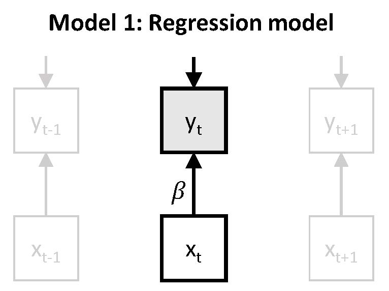
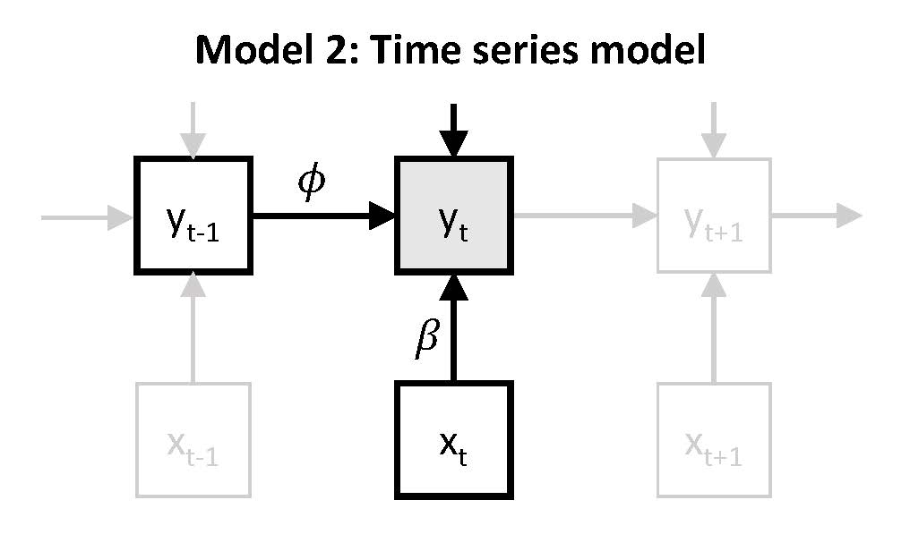
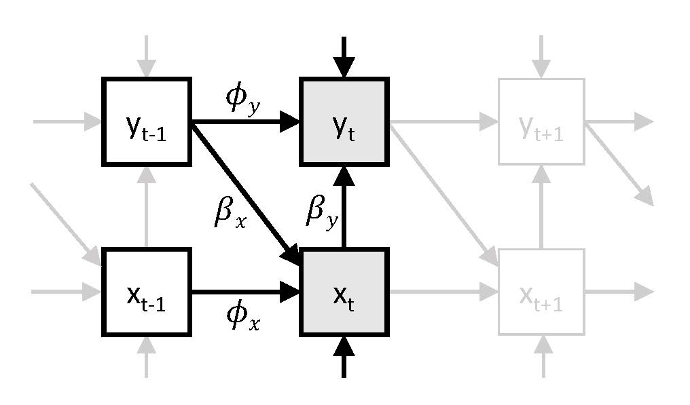

The $N=1$ analyses are based on analyzing the data of each individual separately, and then taking the average across the results. We begin with discussing how such an approach can be taken in Mplus, and discuss some general aspects of the set-up of the analyses. Subsequently, we discuss the three $N=1$ models that were presented in the book chapter.  

# General comments
To analyse the data of all 129 participants in sequence, and summarize the data across all participants, we analyse the data as would be done in a simulation study. Hence, we have to ensure the data for each individual is saved in a separate file with a different name, and we need one file in which all these file names are included.

Below we describe how this kind of analysis is set up, how to obtain standardized parameters, and how to specify that we want to use Bayesian estimation. 

## Setting up replicated $N=1$ analyses
To run separate analyses for each individual and obtain the average results across all these analyses, we make use of the `TYPE = MONTECARLO` option of the `DATA` command; this requires the data for each replication (here: person) to be saved in a separate file. The data file that is then specified in the input file, is a list with the names of these separate data files. Here we use:

    DATA:       FILE = IDlist.dat; 
      	        TYPE = MONTECARLO;  
      	        
In addition, we specify the `VARIABLE` command using:

    VARIABLES:
      NAMES       =   ID prepost TimeHours U2P PA NA PEx NEx
                      pa_pre na_pre U2P_pre PEx_pre NEx_pre
                      pa_post na_post U2P_post PEx_post NEx_post
                      ham_pre ham_post group;
      USEVAR      =   na_pre ue_pre;
      MISSING     =   ALL(-999);

Note that we indicate our analysis are based on the variables na_pre and ue_pre, but the latter is not one of the variables in the original data file (it is not included in the list with `NAMES`). It is based on the observed variable U2P_pre, and created using the `DEFINE` command, through multiplying the observed variable with -1 (such that higher scores indicate more unpleasant events):

    DEFINE:     ue_pre = -1*U2P_pre; 
                STANDARDIZE(na_pre);
                STANDARDIZE(ue_pre);

## Standardization
The two `STANDARDIZE` statements imply that these two variables are standardized; in the current context, it means they are standardized for each person separately. The advantage of this is that our regression coefficients can be interpreted in terms of effect sizes. 

Alternatively, we could also use the `STDYX` option in the `OUTPUT` command; this will imply that first the unstandardized parameter estimates are obtained, which are then standardized using the model implied standard deviations. Note that while for models without lagged relations, these two approaches will lead to very similar results, but for models that include lagged relations (e.g., autoregression), they may deviate: The reason for this is that taking into account the autocorrelation structure in the data, the model implied mean and/or variance of a variable may deviate considerably from the observed mean and variance (specifically when the probability of missing data is different for for instance higher scores than for lower scores).    

## Bayesian esitmation

Throughout, we make use of Bayesian estimation, which is required for doing DSEM analysis in Mplus. We do this by specifying:

    ANALYSIS: ESTIMATOR = BAYES; 
              PROC = 2;
              BITER = (5000);
              THIN = 10;
              BSEED = 9371;

where: 

`PROC = 2` indicates the number of processors to use for this analysis;

`BITER = (5000)` indicates that the number of iterations for the MCMC algorithm must be at least 5000 (Mplus will use more when the Potential Scale Reduction (PRS) statistic indicates that the MCMC algorithm has not converged yet); note that in fact two chains with different starting values are run, both for (at least) 5000 iterations, and the first half of them is discarded as burn-in; hence, the parameter estimates are based on the combination of the second half of both chains.

`THIN = 10` implies that only 1 in 10 iterations of the MCMC sequence are saved; hence, rather than running two chains of at least 5000 iterations each, Mplus will run two chains of 10*5000 each; thinning is used to account for autocorrelation in the MCMC iterations. 

`BSEED = 9371` sets the seed with which to start the first MCMC chain; by default, 2 chains are run. Note that by setting the seed, we can exactly replicate the results that are obtained with such an algorithm. We use a different seed in each analysis.

$~$ 

# $N=1$ Model 1 
Model 1 is based on regressing the outcome $y_t$ on the predictor $x_t$. Note that while $y_t$ and $x_t$ are measured at the same time point, there is an implicit lagged relation between these measures, as $y_t$ is measured with reference to the current moment, whereas $x_t$ is measured with reference to everything since the previous beep.

This model can be represented as:

{width=35%}

$~$

which can be expressed as: $y_t = \nu + \beta x_t + \zeta_t$. The main interest here is in the parameter $\beta$, which represents the expected change in $y_t$ (here: negative affect) after a one unit increase in $x_t$ (here: unpleasantness of events). It can be described as a person's responsiveness, or more specifically here, their _stresss-sensitivity_. 

Instead of considering the unstandardized $\beta$, we decided to focus on the standardized $\beta$ here, which is obtained by standardizing the data prior to analysis. The $\beta$ that is obtained from this analysis represents the number of standard deviations increase in $y_t$ that is expected after a standard deviation increase in $x_t$. Note that since the standard deviations of these variables can be very different for different individuals, the difference between the unstandardized and the standardized $\beta$ will also be person-specific.

## Input for Model 1 

In contrast to all the other models considered here, this model does not include any lagged relations; the latter would imply that the time subscript on the left of the equal sign is not the same as the time subscript on the right of it. Hence, for the current model, we do not need to include any information about the timing of our observations. 

The model is then specified using:
    
    MODEL:
    na_pre ON ue_pre;
    ue_pre;

where the `ON` statement implies that negative affect (measured prior to intervention: na_pre) is regressed on unpleasantness of events (measured prior to intervention: ue_pre); and the second line is to ensure that Mplus will treat the predictor as an endogenous variable, rather than as an exogenous variable (the latter would imply Mplus uses case-wise deletion if there is a missing value on the predictor). 

We ask for additional output using:

    OUTPUT: TECH1 TECH8;

where `TECH1` provides information about the model parameters in terms of the LISREL notation; and `TECH8` provides additional information about convergence of the MCMC algorithm. 

## Output for Model 1
The complete output file for this analysis can be found [here](https://ellenhamaker.github.io/DSEM-book-chapter/nis1model1.htm). 

The parameter estimates that we obtain are averaged across all 129 participants. Specifically, these are:

    MODEL RESULTS

                                  ESTIMATES              S. E.     M. S. E.  95%  % Sig
                      Population   Average   Std. Dev.   Average             Cover Coeff

    NA_PRE     ON
      UE_PRE              0.000     0.3040     0.1735     0.1487     0.1222 0.496 0.504

    Means
      UE_PRE              0.000     0.0016     0.0122     0.1586     0.0002 1.000 0.000

    Intercepts
      NA_PRE              0.000     0.0013     0.0073     0.1477     0.0001 1.000 0.000

    Variances
      UE_PRE              0.500     1.0936     0.0287     0.2617     0.3531 0.000 1.000

    Residual Variances
      NA_PRE              0.500     0.9760     0.1178     0.2329     0.2404 0.062 1.000

The first column `Population` should be ignored, as this is only relevant when a simulation study was performed. 

The column `Average` contains the point estimate averaged across all 129 participants; the column `Std. Dev.` contains the standard deviation of these point estimates across all cases. 

The column `S.E. Average` contains the average standard error cross all cases; note that since we performed a Bayesian analysis, this is the average posterior standard deviation. 

The column `M.S.E.` contains the mean squared error, and `95% Cover` contains the proportion of cases whose 95% credibility interval covers the value in the first column. Both are only relevant if a simulation was done, and should be ignored here. 

The last column `% Sig Coeff` indicates the proportion of cases who have a credibility interval that does not contain zero. The latter can be interpreted as cases whose data contain evidence that this parameter deviates from zero.  

Hence, the current results show that on average the standardized regression coefficient is 0.30, and that about half if the 129 participants have a CI for this parameter that does not contain zero. 

$~$ 

# $N=1$ Model 2 
In model 2, we still consider only negative affect as an outcome variable, which is regressed on the predictor unpleasantness of events. In addition to this concurrent regression, we also regress negative affect on itself at the preceding time point. This is referred to as autoregression, which is described as a form of inertia, carry-over, or regulatory or attractor weakness.  

This model can be represented as:

{width=40%}

$~$ 

which can be expressed as: $y_t = \nu + \beta x_t + \phi y_{t-1} + \zeta_t$. Again, $\beta$ represents the person's responsiveness (or stress-sensitivity), while the autoregressive parameter $\phi$ represents carry-over of $y_{t-1}$ to $y_{t}$ (here: from previous negative affect to current negative affect). Since the autoregressive parameter captures the extent to which a person tends to get stuck in their (affective) state, it has also been referred to as inertia or regulatory weakness.  

## Input for Model 2
Since we now have a lagged effect in our model, we need to consider the intervals between subsequent observations. Here we are dealing with experience sampling, which were obtained at random time points within blocks of 90 minutes. Furthermore, during the night, no measures were obtained. As a result the intervals between subsequent observations can vary from a few minutes to several hours. 

Our data file contains a variable TimeHours that indicates the hours since the beginning of the first day that a person participated in the study. We will use this variable for the `TINTERVAL` option as part of the `VARIABLE` command, through including: 

    TINTERVAL   =   TimeHours(1);
    
The specification `(1)` indicates the time grid that we use (here: 1 hour, as the TimeHour variable is in hours; 0.5 would result in a half hour time grid).

In addition, we also need a lagged version of the observed variable for the autoregression. To this end we use the `LAGGED` option in the `VARIABLE` command:

    LAGGED      =   na_pre(1);

This creates a new variable na_pre&1 which we can use in our `MODEL`command, where we specify the model as:

    MODEL:
    na_pre ON na_pre&1;
    na_pre ON ue_pre;
    ue_pre;

where the two `ON` statements are used to specify the two regressions, and the last line is again included to change the predictor into an endogenous variable. 

## Output for Model 2
The total output for this model is can be found 
[here](https://jeroendmulder.github.io/Hamaker2021/nis1model2.htm).

The average parameter estimates are summarized as:

    MODEL RESULTS

                                   ESTIMATES              S. E.     M. S. E.  95%  % Sig
                      Population   Average   Std. Dev.   Average             Cover Coeff

    NA_PRE     ON
      NA_PRE&1            0.000     0.3620     0.2764     0.1693     0.2069 0.504 0.496
      UE_PRE              0.000     0.2668     0.1614     0.1410     0.0970 0.496 0.504

    Means
      UE_PRE              0.000     0.0025     0.0187     0.1572     0.0004 1.000 0.000

    Intercepts
      NA_PRE              0.000    -0.0062     0.0198     0.1159     0.0004 1.000 0.000

    Variances
      UE_PRE              0.500     1.0869     0.0284     0.2587     0.3452 0.000 1.000

    Residual Variances
      NA_PRE              0.500     0.7377     0.2271     0.1941     0.1077 0.419 1.000

Again, we should only focus on the columns `Average`, `Std. Dev.`, and `% Sig. Coeff`. It shows that the average standardized regression coefficient for unpleasantness of events ($\beta$) has gone down somewhat in comparison to Model 1; it is now 0.267. The average autoregressive effect ($\phi$) is somewhat larger than the average standardized regression coefficient; it is 0.362. Furthermore, both parameters seem to show quite some variation across participants, and about half of the participants have an autoregressive parameter for which there is evidence that it deviates from zero, and the same is true for the other standardized regression parameter. 

$~$ 

# $N=1$ Model 3
In Model 3 we consider not only negative affect as an outcome, but also unpleasantness of event. Hence, we have a bivariate time series model, in which we regress negative affect $y_t$ on $x_t$ AFMAKEN

{width=40%}

## Input for Model 3
We can specify this model using the following `MODEL` command:

      MODEL:
          na_pre ON na_pre&1;
          na_pre ON ue_pre;
          ue_pre ON ue_pre&1;
          ue_pre ON na_pre&1;

## Output for Model 3
The output file for this analysis can be find [here](https://jeroendmulder.github.io/Hamaker2021/nis1model3.htm).

The average parameter estimates obtained for this model are:

    MODEL RESULTS

                                  ESTIMATES              S. E.     M. S. E.  95%  % Sig
                     Population   Average   Std. Dev.   Average             Cover Coeff

     NA_PRE     ON
      NA_PRE&1            0.000     0.3638     0.2780     0.1762     0.2090 0.504 0.496
      UE_PRE              0.000     0.2496     0.1740     0.1547     0.0923 0.620 0.380

     UE_PRE     ON
      UE_PRE&1            0.000     0.0375     0.2321     0.2064     0.0548 0.938 0.062
      NA_PRE&1            0.000     0.1007     0.2414     0.2151     0.0680 0.876 0.124

     Intercepts
      NA_PRE              0.000    -0.0058     0.0225     0.1150     0.0005 1.000 0.000
      UE_PRE              0.000     0.0056     0.0372     0.1551     0.0014 1.000 0.000

     Residual Variances
      NA_PRE              0.500     0.7404     0.2253     0.1927     0.1082 0.442 1.000
      UE_PRE              0.500     0.9537     0.1220     0.2494     0.2206 0.163 1.000

It shows that while negative affect seems to be characterized by carry-over (autoregression) and spill-over (cross-regression) defect for a substantial number of participants (49.5% and 38.0% respectively), there is very little evidence that unpleasantness of events is characterized by carry-over (only 6.2% of participants showed evidence for autoregression), and there is only some evidence for spill-over of negative affect into unpleasantness of events (12.4% of participants show evidence for a non-zero cross-lagged regression). 

---
